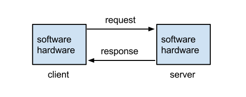
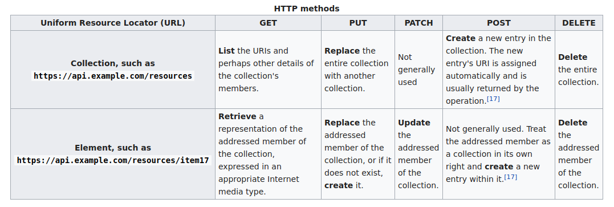

% How do I into the Internet?
% Michał Zając

# HTTP

## Inception

Tim Berners-Lee @ CERN in 1989

## HTTP 0.9

Released in 1991

## HTTP 1.0

Released in 1996

## HTTP 1.1

Officially released in 1997

## HTTP 2.0

Officially released in 2015

# Architecture

## Client-server

{.stretch}\ 

## Client

Client... requests things?

## Server

Server provides those things

# Requests

## GET

Give me a webpage.

## HEAD

Give me a webpage but without the webpage.

This request should not have a body.

## POST

I'm sending you some data mate.

## PUT

Replace that with this.

## PATCH

Here are some small changes, apply them.

## DELETE

Remove speaker from the premises.

This request should not have a body.

## Others

TRACE, OPTIONS, CONNECT

# Responses

## 1xx status codes

Give information, for ex. 101 Switching Protocols

## 2xx status codes

This class indicates that the request was received, understood, accepted and processed successfully

ex. 200 OK

## 3xx status codes

This class indicates that the client must take additional action to complete the request

ex. 301 Moved Permamently

## 4xx status codes

This class of status code is intended for situations in which the error seems to have been caused by the client.

ex. 404 Not Found

## 5xx status codes

These status codes indicate cases in which the server is aware that it has encountered an error.

ex. 500 Internal Server Error

## 418 I'm a teapot

This code should be returned by teapots requested to brew coffee.

# Example HTTP session

## Request

```
GET /index.html HTTP/1.1
Host: www.example.com
```

## Response

```
HTTP/1.1 200 OK
Date: Mon, 23 May 2005 22:38:34 GMT
Content-Type: text/html; charset=UTF-8
Content-Encoding: UTF-8
Content-Length: 138
Last-Modified: Wed, 08 Jan 2003 23:11:55 GMT
Server: Apache/1.3.3.7 (Unix) (Red-Hat/Linux)
ETag: "3f80f-1b6-3e1cb03b"
Accept-Ranges: bytes
Connection: close

<html>
<head>
  <title>An Example Page</title>
</head>
<body>
  Hello World, this is a very simple HTML document.
</body>
</html>
```

# Security

## HTTP

HTTP ALONE IS NOT SECURE, USING HTTP IN 2017 SHOULD BE FORBIDDEN 

## HTTPS

HTTP within a connection encryped by Transport Layer Security

# REST

## What is REST?

REpresentational State Trasfer is a way of providing interoperability between computer systems on the Internet.

## In simpler terms

{.stretch}\ 

# Questions?

# Further reading

##

#. [Wikipedia: HTTP](https://www.wikiwand.com/en/Hypertext_Transfer_Protocol)
#. [Wikipedia: List of HTTP status codes](https://www.wikiwand.com/en/List_of_HTTP_status_codes)
#. [IEFT: RFC7231](https://tools.ietf.org/html/rfc7231)
#. [Wikipedia: HTTPS](https://www.wikiwand.com/en/HTTPS)
#. [Wikipedia: Transport Layer Security](https://www.wikiwand.com/en/Transport_Layer_Security)
#. [REST](https://www.ics.uci.edu/~fielding/pubs/dissertation/top.htm)
#. [Wikipedia: Representational state transfer](https://www.wikiwand.com/en/Representational_state_transfer)

# Thanks!
